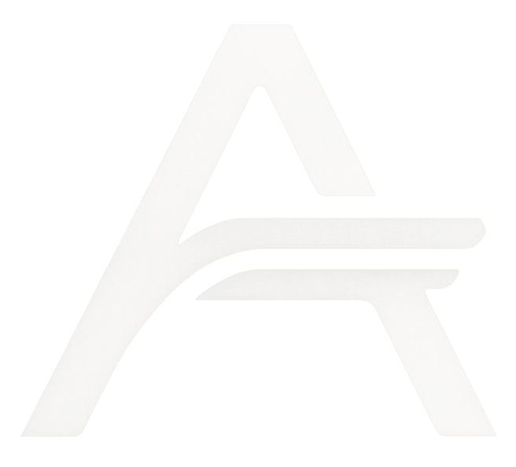

<p align="center">
  
</p>

<h1 align="center">arjunkuttikkat.com</h1>

<p align="center">
  Personal founder website for Arjun Kuttikkat, built to present projects, writing, and product direction with clarity.
</p>

<p align="center">
  <a href="./LICENSE">MIT License</a>
  ·
  <a href="https://arjunkuttikkat.com">Live Site</a>
  ·
  <a href="#overview">Overview</a>
  ·
  <a href="#getting-started">Getting Started</a>
  ·
  <a href="#license">License</a>
</p>

<p align="center">
  <a href="./CONTRIBUTING.md">Contributing</a>
  ·
  <a href="./SECURITY.md">Security</a>
  ·
  <a href="./CODE_OF_CONDUCT.md">Code of Conduct</a>
</p>

## Overview

`arjunkuttikkat.com` is the public-facing website for Arjun Kuttikkat. It is designed as a clean, high-signal surface for people who want to quickly understand:

- who he is
- what he is building
- the projects he has worked on
- the writing and ideas behind that work

This repository powers a modern personal site with a founder-oriented narrative, a project archive, MDX-backed publishing, and newsletter capture. The goal is not to be a generic portfolio template, but a deliberate product and credibility layer for Arjun's work on AI workflows, distribution, and internet products.

## Project Status

Active. This repository is the working codebase behind the live site and is maintained as an evolving public-facing product.

## What The Site Includes

- A homepage that introduces Arjun, his current focus, and featured work.
- A dedicated projects experience that highlights both active and exploratory products.
- An about page that gives personal background and builder context.
- A blog system backed by MDX content stored in-repo.
- A newsletter flow with server-side validation and subscription handling.
- SEO metadata, social previews, and a polished visual system appropriate for a public-facing founder brand.

## Why This Repository Exists

This codebase exists to serve as the canonical source for Arjun's online presence. Instead of spreading context across messages, slide decks, threads, and partially updated pages, the site provides one reliable place to understand the work clearly.

For collaborators, investors, operators, or curious readers, the site functions as a concise introduction first and a deeper reference second.

## Product Positioning

The site is best understood as a personal brand and company-adjacent web property. It sits at the intersection of:

- founder website
- project archive
- writing platform
- credibility layer for ongoing products such as Edgaze

It is intentionally editorial rather than template-driven, and intentionally structured rather than decorative.

## Core Features

- `App Router` architecture with route-level metadata
- `TypeScript` across application and content logic
- `MDX` publishing workflow for long-form writing
- project metadata modeled in code for consistent rendering
- newsletter subscription endpoint with validation and rate limiting
- animated UI using `Framer Motion`
- responsive layout and design system built with `Tailwind CSS`

## Tech Stack

- `Next.js`
- `React`
- `TypeScript`
- `Tailwind CSS`
- `Framer Motion`
- `MDX`
- `Zod`
- `Brevo` for newsletter delivery
- `Vercel`-friendly deployment model

## Repository Structure

```text
.
|-- app/                  # App Router pages and API routes
|-- components/           # Reusable UI building blocks
|-- content/
|   `-- blogs/            # MDX blog posts
|-- lib/                  # Content parsing, project data, utilities
|-- public/               # Static assets including the site logo
|-- package.json          # Scripts and dependencies
`-- README.md
```

## Content Model

The site content is intentionally split into two clear systems:

- `lib/projects.ts` stores structured project metadata (summary, state, snapshot, stack, links) used throughout the projects experience.
- `lib/technologies.ts` is the technology registry: id → name, logo (Simple Icons via `react-icons/si` or a local SVG), website, optical scale. Projects declare their stack as ids.
- `lib/edgaze.ts` holds the static, publicly verifiable facts about Edgaze (surfaces, run lifecycle, API, MCP, billing) shared by the Edgaze project page and the homepage section.
- `components/projects/pages/*` composes one page per project from the primitives in `components/projects/detail/` (hero, section rail, figures, definition lists, flows, architecture map, stack).
- `content/blogs/*.mdx` stores long-form writing with typed frontmatter and publishing controls.

This keeps editorial content easy to maintain while preserving strong control over the presentation layer.

## Getting Started

### Prerequisites

- `Node.js` 20+
- `npm`

### Installation

```bash
npm install
```

### Environment Variables

Copy the example file and fill in your own values:

```bash
cp .env.example .env.local
```

Required variables:

- `BREVO_API_KEY`
- `BREVO_LIST_ID`
- `BREVO_NEWSLETTER_ENABLED`

### Run Locally

```bash
npm run dev
```

The application will start in development mode and can then be viewed locally in the browser.

## Available Scripts

- `npm run dev` starts the local development server
- `npm run build` creates the production build
- `npm run start` runs the production server
- `npm run lint` runs ESLint across the project
- `npm run typecheck` runs the TypeScript compiler without emitting output

## Publishing Workflow

New writing is added as `.mdx` files under `content/blogs/`. Frontmatter is validated in code, and published posts are surfaced automatically across the site.

This keeps the writing workflow simple for the author while preserving consistent metadata, ordering, and rendering rules.

## Newsletter Integration

The site includes a newsletter subscription flow backed by Brevo. The API route validates requests, applies lightweight rate limiting, and handles contact creation or updates server-side.

This keeps the public UI straightforward while moving operational concerns into a controlled backend route.

## Deployment

The project is structured for straightforward deployment on platforms that support Next.js applications, with Vercel being the most natural fit.

A standard production workflow is:

1. install dependencies
2. provide environment variables
3. run `npm run build`
4. deploy the built application

## Contributing

This is a personal website repository, so the design direction, content, and product decisions are intentionally opinionated and centrally maintained.

If you want to suggest an improvement, open an issue or share the idea first before preparing a larger change.

## Security Notes

- Do not commit real API keys or local environment files.
- Use `.env.example` as the reference for required configuration.
- Keep production secrets in your deployment platform's environment settings.

## Standards

This repository aims to be:

- readable
- maintainable
- editorially consistent
- production-ready in presentation
- simple to extend without turning into a generic starter

## Maintainer

Maintained by Arjun Kuttikkat.

## License

This project is licensed under the MIT License. See `LICENSE` for details.
